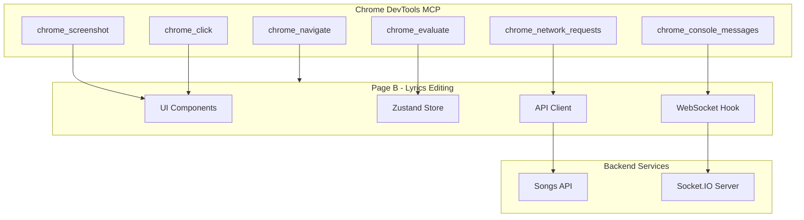

# Design Document: Page B Debugging with Chrome DevTools MCP

## Overview

This design document outlines the approach for debugging Page B (Lyrics Editing Page) using Chrome DevTools MCP. The debugging workflow provides systematic verification of UI components, state management, WebSocket connections, and API interactions through programmatic Chrome DevTools access.

## Architecture



## Components and Interfaces

### Chrome DevTools MCP Tools

| Tool | Purpose | Usage |
|------|---------|-------|
| `chrome_navigate` | Navigate to Page B URL | Initial page load |
| `chrome_screenshot` | Capture visual state | Visual verification |
| `chrome_evaluate` | Execute JavaScript | Inspect React/Zustand state |
| `chrome_console_messages` | Read console logs | Debug logs and errors |
| `chrome_network_requests` | Monitor HTTP/WS traffic | API and WebSocket debugging |
| `chrome_click` | Simulate user clicks | Trigger UI interactions |

### Target Components

1. **LyricsEditor** - Textarea with character counter
   - State: `editedLyrics`, character count
   - Visual states: normal, warning (2700+), error (3000+)

2. **StyleSelector** - Dropdown for music style
   - State: `selectedStyle`
   - Options: pop, rap, folk, electronic, rock, jazz, children, classical

3. **GenerateSongButton** - Song generation trigger
   - State: disabled conditions, loading state
   - Keyboard shortcut: Ctrl+Enter

4. **ProgressTracker** - Generation progress display
   - State: status, progress percentage
   - WebSocket connection indicator

### Zustand Store Structure

```typescript
interface LyricsEditingState {
  originalLyrics: string;
  editedLyrics: string;
  selectedStyle: MusicStyle;
  contentHash: string;
  isGenerating: boolean;
  taskId: string | null;
  generationStatus: 'idle' | 'queued' | 'processing' | 'completed' | 'failed';
  progress: number;
  songUrl: string | null;
  error: string | null;
}
```

## Data Models

### Debug Session Data

```typescript
interface DebugSession {
  pageUrl: string;
  timestamp: Date;
  consoleErrors: ConsoleMessage[];
  networkRequests: NetworkRequest[];
  storeSnapshot: LyricsEditingState;
  componentStates: ComponentState[];
}

interface ConsoleMessage {
  level: 'log' | 'warn' | 'error';
  message: string;
  timestamp: Date;
}

interface NetworkRequest {
  url: string;
  method: string;
  status: number;
  duration: number;
  payload?: object;
  response?: object;
}
```

## Correctness Properties

*A property is a characteristic or behavior that should hold true across all valid executions of a system-essentially, a formal statement about what the system should do. Properties serve as the bridge between human-readable specifications and machine-verifiable correctness guarantees.*

Since this is a debugging workflow specification, the acceptance criteria are primarily example-based tests rather than universal properties. The debugging tasks verify specific observable behaviors through Chrome DevTools MCP tools.

**Note:** This spec focuses on manual debugging procedures using MCP tools. The correctness is verified through observable outcomes (console messages, network requests, DOM state) rather than automated property-based tests.

## Error Handling

### MCP Tool Errors

| Error | Handling |
|-------|----------|
| Navigation timeout | Retry with increased timeout, check if server is running |
| Evaluate script error | Log error, check JavaScript syntax |
| Network capture failure | Verify Chrome DevTools connection |
| Screenshot failure | Check page visibility and rendering |

### Page B Errors to Debug

| Error Type | Detection Method | Expected Behavior |
|------------|------------------|-------------------|
| Console errors | `chrome_console_messages` | No errors on normal load |
| Network failures | `chrome_network_requests` | Proper error UI displayed |
| WebSocket disconnect | Console logs + Network | Auto-reconnect triggered |
| Validation errors | DOM inspection | Error message visible |

## Testing Strategy

### Debugging Workflow Phases

**Phase 1: Page Load Verification**
- Navigate to `/lyrics-edit`
- Capture console messages
- Verify no errors on load
- Check Zustand store initialization

**Phase 2: Component State Inspection**
- Evaluate each component's DOM state
- Verify character counter accuracy
- Check style selector options
- Verify button disabled states

**Phase 3: WebSocket Debugging**
- Monitor WebSocket connection
- Verify authentication handshake
- Test message reception
- Verify reconnection behavior

**Phase 4: API Request Monitoring**
- Capture song generation request
- Verify request payload
- Monitor polling requests
- Check error responses

**Phase 5: Error Scenario Testing**
- Simulate network offline
- Test rate limit handling
- Test validation errors
- Test timeout scenarios

### MCP Tool Usage Examples

```javascript
// Example: Check Zustand store state
chrome_evaluate({
  expression: `
    const store = window.__ZUSTAND_DEVTOOLS__;
    if (store) {
      JSON.stringify(store.getState());
    } else {
      // Fallback: check sessionStorage
      sessionStorage.getItem('lyrics-editing-storage');
    }
  `
});

// Example: Check character counter
chrome_evaluate({
  expression: `
    const counter = document.querySelector('[data-testid="character-counter"]');
    counter ? counter.textContent : 'Counter not found';
  `
});

// Example: Verify WebSocket connection status
chrome_evaluate({
  expression: `
    const indicator = document.querySelector('[data-testid="ws-status"]');
    indicator ? indicator.dataset.status : 'Indicator not found';
  `
});
```

