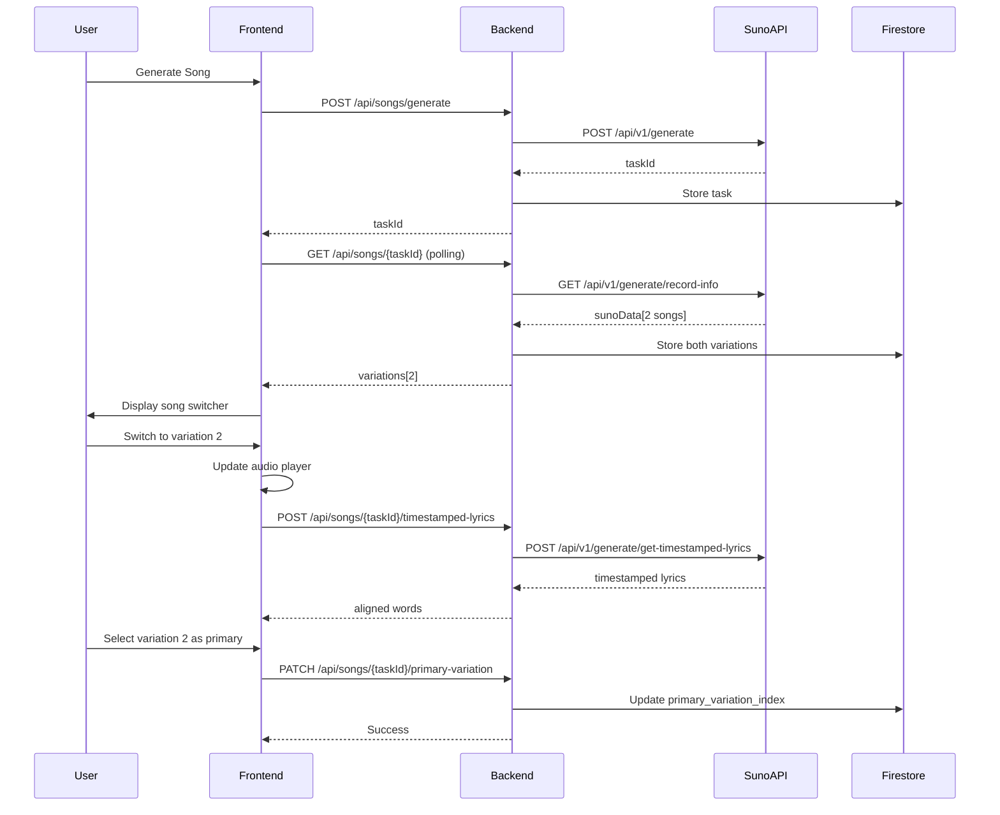

# Design Document

## Overview

This feature enhances the LearningSong application to support dual song generation, allowing users to receive two song variations from a single API request and switch between them to select their preferred version. The Suno API generates two songs by default, but the current implementation only presents the first song. This design introduces a song switcher UI component, backend API modifications to handle multiple variations, and database schema updates to store both songs.

### Key Design Goals

1. **Minimal API Calls**: Leverage the existing dual-song generation behavior without additional API requests
2. **User Choice**: Empower users to compare and select their preferred song variation
3. **Seamless Integration**: Integrate smoothly with existing audio player and timestamped lyrics features
4. **Data Persistence**: Store user preferences and maintain both variations for future access
5. **Graceful Degradation**: Handle cases where only one song is available

## Architecture

### High-Level Flow

```
User generates song
    ↓
Backend calls Suno API (generates 2 songs)
    ↓
Backend stores both variations in Firestore
    ↓
Frontend displays song switcher UI
    ↓
User switches between versions
    ↓
Frontend updates audio player + fetches new timestamped lyrics
    ↓
User selects preferred version
    ↓
Backend updates primary song selection
```

### Component Interaction Diagram




## Components and Interfaces

### Backend Components

#### 1. SunoClient Modifications (`backend/app/services/suno_client.py`)

**Current Behavior:**
- `get_task_status()` returns only the first song from `sunoData[0]`

**New Behavior:**
- Return all available songs from `sunoData` array
- Create new data class `SongVariation` to represent each song

```python
@dataclass
class SongVariation:
    """Represents a single song variation from Suno API."""
    audio_url: str
    audio_id: str
    variation_index: int  # 0 or 1
    
@dataclass
class SunoStatus:
    """Updated to support multiple variations."""
    status: str
    progress: int
    variations: list[SongVariation]  # Changed from single song_url
    error: Optional[str] = None
```

#### 2. Song Storage Service (`backend/app/services/song_storage.py`)

**Schema Updates:**

```python
# Current schema
{
    "task_id": str,
    "user_id": str,
    "song_url": str,  # Single URL
    "audio_id": str,  # Single ID
    ...
}

# New schema
{
    "task_id": str,
    "user_id": str,
    "variations": [
        {
            "audio_url": str,
            "audio_id": str,
            "variation_index": int
        },
        {
            "audio_url": str,
            "audio_id": str,
            "variation_index": int
        }
    ],
    "primary_variation_index": int,  # 0 or 1 (default: 0)
    "song_url": str,  # Deprecated but kept for backward compatibility
    ...
}
```

**New Functions:**

```python
async def update_primary_variation(
    task_id: str,
    variation_index: int
) -> bool:
    """Update which variation is the user's primary selection."""
```

#### 3. API Endpoints (`backend/app/api/songs.py`)

**Modified Endpoints:**

```python
@router.get("/{task_id}", response_model=SongStatusUpdate)
async def get_song_status(...) -> SongStatusUpdate:
    """
    Now returns variations array instead of single song_url.
    """

@router.get("/{song_id}/details", response_model=SongDetails)
async def get_song_details(...) -> SongDetails:
    """
    Now returns variations array and primary_variation_index.
    """
```

**New Endpoints:**

```python
@router.patch("/{task_id}/primary-variation")
async def update_primary_variation(
    task_id: str,
    variation_index: int,
    user_id: str = Depends(get_current_user)
) -> dict:
    """
    Update the user's primary song variation selection.
    
    Args:
        task_id: Song task ID
        variation_index: Index of selected variation (0 or 1)
        user_id: Authenticated user ID
        
    Returns:
        {"success": true, "primary_variation_index": int}
    """

@router.post("/{task_id}/timestamped-lyrics/{variation_index}")
async def get_variation_timestamped_lyrics(
    task_id: str,
    variation_index: int,
    user_id: str = Depends(get_current_user)
) -> dict:
    """
    Fetch timestamped lyrics for a specific variation.
    
    Args:
        task_id: Song task ID
        variation_index: Which variation (0 or 1)
        user_id: Authenticated user ID
        
    Returns:
        {"aligned_words": [...], "waveform_data": [...]}
    """
```


### Frontend Components

#### 1. Song Switcher Component (`frontend/src/components/SongSwitcher.tsx`)

**New Component:**

```typescript
interface SongSwitcherProps {
  variations: SongVariation[]
  activeIndex: number
  onSwitch: (index: number) => void
  isLoading?: boolean
  disabled?: boolean
}

export function SongSwitcher({
  variations,
  activeIndex,
  onSwitch,
  isLoading,
  disabled
}: SongSwitcherProps) {
  // Renders toggle buttons for Version 1 / Version 2
  // Shows loading state during switch
  // Keyboard accessible (Tab, Arrow keys, Enter/Space)
  // Screen reader friendly with ARIA labels
}
```

**Visual Design:**
- Segmented control style (similar to iOS)
- Clear active state indication
- Smooth transitions
- Mobile-friendly touch targets (min 44x44px)

#### 2. Updated Models (`frontend/src/api/songs.ts`)

```typescript
export interface SongVariation {
  audioUrl: string
  audioId: string
  variationIndex: number
}

export interface SongStatusUpdate {
  task_id: string
  status: GenerationStatus
  progress: number
  variations: SongVariation[]  // Changed from song_url
  error?: string
}

export interface SongDetails {
  song_id: string
  variations: SongVariation[]
  primary_variation_index: number
  lyrics: string
  style: MusicStyle
  created_at: string
  expires_at: string
  is_owner: boolean
  aligned_words?: AlignedWord[]
  waveform_data?: number[]
  has_timestamps: boolean
}
```

#### 3. Updated Hooks

**`useSongGeneration.ts`:**
- Handle `variations` array instead of single `song_url`
- Store all variations in Zustand store

**New Hook: `useSongSwitcher.ts`:**

```typescript
interface UseSongSwitcherOptions {
  taskId: string
  variations: SongVariation[]
  initialIndex?: number
  onSwitch?: (index: number) => void
}

export function useSongSwitcher({
  taskId,
  variations,
  initialIndex = 0,
  onSwitch
}: UseSongSwitcherOptions) {
  const [activeIndex, setActiveIndex] = useState(initialIndex)
  const [isLoading, setIsLoading] = useState(false)
  
  const switchVariation = async (index: number) => {
    setIsLoading(true)
    try {
      // Fetch timestamped lyrics for new variation
      await fetchTimestampedLyrics(taskId, index)
      
      // Update primary variation on backend
      await updatePrimaryVariation(taskId, index)
      
      setActiveIndex(index)
      onSwitch?.(index)
    } catch (error) {
      // Handle error
    } finally {
      setIsLoading(false)
    }
  }
  
  return {
    activeIndex,
    switchVariation,
    isLoading,
    currentVariation: variations[activeIndex]
  }
}
```

#### 4. Updated Stores (`frontend/src/stores/lyricsEditingStore.ts`)

```typescript
interface LyricsEditingState {
  // ... existing fields
  
  // New fields for dual songs
  songVariations: SongVariation[]
  primaryVariationIndex: number
  
  // New actions
  setSongVariations: (variations: SongVariation[]) => void
  setPrimaryVariationIndex: (index: number) => void
}
```

#### 5. Updated Pages

**`LyricsEditingPage.tsx`:**
- Display SongSwitcher when generation completes
- Pass variations to playback page

**`PlaybackPage.tsx` (New/Updated):**
- Integrate SongSwitcher component
- Handle variation switching
- Update audio player source on switch
- Fetch new timestamped lyrics on switch


## Data Models

### Backend Models

#### SongVariation (Python)

```python
from pydantic import BaseModel, Field

class SongVariation(BaseModel):
    """Represents a single song variation."""
    
    audio_url: str = Field(
        ...,
        description="URL of the song audio file"
    )
    audio_id: str = Field(
        ...,
        description="Unique identifier for fetching timestamped lyrics"
    )
    variation_index: int = Field(
        ...,
        description="Index of this variation (0 or 1)",
        ge=0,
        le=1
    )
```

#### Updated SongDetails

```python
class SongDetails(BaseModel):
    """Complete song details with multiple variations."""
    
    song_id: str
    variations: list[SongVariation] = Field(
        ...,
        description="Array of song variations (1-2 items)",
        min_length=1,
        max_length=2
    )
    primary_variation_index: int = Field(
        default=0,
        description="Index of user's selected primary variation",
        ge=0,
        le=1
    )
    lyrics: str
    style: MusicStyle
    created_at: datetime
    expires_at: datetime
    is_owner: bool
    aligned_words: Optional[list[dict]] = None
    waveform_data: Optional[list[float]] = None
    has_timestamps: bool = False
```

#### UpdatePrimaryVariationRequest

```python
class UpdatePrimaryVariationRequest(BaseModel):
    """Request to update primary variation selection."""
    
    variation_index: int = Field(
        ...,
        description="Index of the variation to set as primary",
        ge=0,
        le=1
    )
```

### Frontend Models

#### SongVariation (TypeScript)

```typescript
export interface SongVariation {
  audioUrl: string
  audioId: string
  variationIndex: number
}
```

#### Updated SongDetails

```typescript
export interface SongDetails {
  song_id: string
  variations: SongVariation[]
  primary_variation_index: number
  lyrics: string
  style: MusicStyle
  created_at: string
  expires_at: string
  is_owner: boolean
  aligned_words?: AlignedWord[]
  waveform_data?: number[]
  has_timestamps: boolean
}
```

### Database Schema (Firestore)

#### Songs Collection

```typescript
{
  // Existing fields
  task_id: string
  user_id: string
  content_hash: string
  lyrics: string
  style: string
  status: string
  progress: number
  error: string | null
  created_at: Timestamp
  updated_at: Timestamp
  expires_at: Timestamp
  
  // New fields for dual songs
  variations: [
    {
      audio_url: string
      audio_id: string
      variation_index: number
    },
    {
      audio_url: string
      audio_id: string
      variation_index: number
    }
  ]
  primary_variation_index: number  // Default: 0
  
  // Deprecated but kept for backward compatibility
  song_url: string  // Points to primary variation
  audio_id: string  // Points to primary variation
  
  // Timestamped lyrics (per variation)
  aligned_words: object[]  // For primary variation
  waveform_data: number[]  // For primary variation
  has_timestamps: boolean
}
```


## Correctness Properties

*A property is a characteristic or behavior that should hold true across all valid executions of a system-essentially, a formal statement about what the system should do. Properties serve as the bridge between human-readable specifications and machine-verifiable correctness guarantees.*

### Property 1: Dual song extraction completeness
*For any* valid Suno API response containing a sunoData array, the system should extract all available song variations (up to 2) with their audio URLs and audio IDs.
**Validates: Requirements 1.1, 7.1**

### Property 2: Variation storage completeness
*For any* set of song variations extracted from the API, all variations should be stored in the database with their audio_url, audio_id, and variation_index fields populated.
**Validates: Requirements 1.2, 7.3**

### Property 3: Default primary variation
*For any* newly completed song generation, the primary_variation_index should be set to 0 (first variation).
**Validates: Requirements 1.3**

### Property 4: Variation order preservation
*For any* stored song variations, the variation_index field should match the array position (variations[0].variation_index === 0, variations[1].variation_index === 1).
**Validates: Requirements 1.4**

### Property 5: Switcher visibility with multiple variations
*For any* song with exactly 2 variations, the song switcher component should be rendered and visible in the UI.
**Validates: Requirements 2.1**

### Property 6: Switcher hidden with single variation
*For any* song with exactly 1 variation, the song switcher component should not be rendered in the UI.
**Validates: Requirements 2.2**

### Property 7: Active variation indication
*For any* displayed song switcher, the variation matching the current activeIndex should have distinct visual styling or attributes indicating it is active.
**Validates: Requirements 2.4**

### Property 8: Variation switch triggers state update
*For any* user interaction that switches to a different variation index, the system should update the activeIndex state and trigger loading of the new variation's audio and lyrics.
**Validates: Requirements 3.1, 3.3, 3.4**

### Property 9: Playback position preservation
*For any* variation switch operation, if the current playback position is available and valid, it should be preserved and applied to the new variation's audio player.
**Validates: Requirements 3.2**

### Property 10: Loading state during switch
*For any* variation switch operation that is in progress, the switcher component should display a loading indicator until the operation completes or fails.
**Validates: Requirements 3.5**

### Property 11: Switch failure recovery
*For any* variation switch operation that fails, the system should revert to the previously active variation index and display an error message.
**Validates: Requirements 3.6**

### Property 12: Primary variation persistence
*For any* user selection of a variation as primary, the database should be updated with the new primary_variation_index value, and subsequent retrievals should reflect this selection.
**Validates: Requirements 4.1, 4.2**

### Property 13: Variation data preservation
*For any* update to the primary_variation_index, all variation records in the variations array should remain unchanged in the database.
**Validates: Requirements 4.3**

### Property 14: Playback control during switch
*For any* variation switch operation, the current audio playback should be stopped before loading the new variation's audio source.
**Validates: Requirements 5.1**

### Property 15: Playback state preservation
*For any* variation switch where audio was playing before the switch, the new variation should automatically start playing after loading; if paused, it should remain paused.
**Validates: Requirements 5.4, 5.5**

### Property 16: Timestamped lyrics fetch with correct audio ID
*For any* variation switch operation, the system should fetch timestamped lyrics using the audio_id of the newly selected variation.
**Validates: Requirements 6.1**

### Property 17: Lyrics sync after switch
*For any* successfully loaded timestamped lyrics after a variation switch, the lyrics highlighting should synchronize with the new variation's audio timing.
**Validates: Requirements 6.3**

### Property 18: Lyrics fallback on fetch failure
*For any* failed timestamped lyrics fetch, the system should display the original plain text lyrics without timing synchronization.
**Validates: Requirements 6.4**

### Property 19: Request cancellation on switch
*For any* variation switch operation, any pending timestamped lyrics requests for the previous variation should be cancelled before fetching lyrics for the new variation.
**Validates: Requirements 6.5**

### Property 20: API response format completeness
*For any* song generation status response returned to the frontend, the response should include a variations array containing all available song variations with their audio URLs and audio IDs.
**Validates: Requirements 7.2, 7.4**

### Property 21: Variation-specific error isolation
*For any* song variation that fails to load, the error should be displayed only for that specific variation without affecting the availability of other variations.
**Validates: Requirements 8.3**

### Property 22: Offline update queueing
*For any* primary variation update attempted while offline, the system should queue the update and display an offline indicator, then process the update when connectivity is restored.
**Validates: Requirements 8.5**

### Property 23: Keyboard navigation support
*For any* song switcher component, users should be able to navigate between variations using keyboard controls (Tab, Arrow keys) and activate selections using Enter or Space keys.
**Validates: Requirements 9.2**

### Property 24: Focus indication
*For any* focused element within the song switcher, the element should have visible focus indicators (outline, border, or background change).
**Validates: Requirements 9.3**

### Property 25: Screen reader accessibility
*For any* song switcher component, all interactive elements should have appropriate ARIA labels announcing the current version and available options.
**Validates: Requirements 9.4**

### Property 26: Selection event logging
*For any* user action that switches to a different variation, the system should log an analytics event containing the variation_index, timestamp, and user context.
**Validates: Requirements 10.1, 10.3**

### Property 27: Play event tracking
*For any* audio playback start event, the system should record which variation_index is being played.
**Validates: Requirements 10.2**

### Property 28: Share link uses primary variation
*For any* song share operation, the generated share link should reference the user's selected primary variation.
**Validates: Requirements 10.4**


## Error Handling

### Backend Error Scenarios

#### 1. Suno API Returns Only One Song
**Scenario:** Suno API returns `sunoData` array with only 1 item instead of 2

**Handling:**
- Store the single variation with `variation_index: 0`
- Set `primary_variation_index: 0`
- Log warning: "Expected 2 variations but received 1"
- Frontend hides switcher component (only 1 variation available)

#### 2. Suno API Returns Malformed Data
**Scenario:** `sunoData` contains items missing `audioUrl` or `id` fields

**Handling:**
- Validate each variation before storing
- Skip malformed variations and log error
- Store only valid variations
- If no valid variations, mark task as FAILED with error message

#### 3. Database Update Fails
**Scenario:** Firestore update for `primary_variation_index` fails

**Handling:**
- Return 500 error to frontend
- Log error with task_id and user_id
- Frontend displays error toast but allows continued playback
- User can retry the selection

#### 4. Timestamped Lyrics Fetch Fails
**Scenario:** Suno API returns error when fetching timestamped lyrics for a variation

**Handling:**
- Log warning with audio_id
- Return empty `aligned_words` array
- Frontend falls back to displaying plain lyrics
- Does not block audio playback

### Frontend Error Scenarios

#### 1. Variation Switch Network Error
**Scenario:** Network request fails during variation switch

**Handling:**
```typescript
try {
  await switchVariation(newIndex)
} catch (error) {
  // Revert to previous variation
  setActiveIndex(previousIndex)
  
  // Show error toast
  toast.error('Failed to switch song version. Please try again.')
  
  // Log error for debugging
  console.error('Variation switch failed:', error)
}
```

#### 2. Audio Loading Error
**Scenario:** New variation's audio URL fails to load

**Handling:**
- Display error message: "This version failed to load"
- Keep switcher enabled for other variation
- Allow user to try other variation or retry current one
- Log error with variation_index and audio_url

#### 3. Offline During Switch
**Scenario:** User loses network connectivity while switching

**Handling:**
- Detect offline state via `navigator.onLine`
- Show offline indicator
- Queue primary variation update
- Allow audio playback if already cached
- Process queued update when online

#### 4. Concurrent Switch Requests
**Scenario:** User rapidly clicks between variations

**Handling:**
- Debounce switch requests (300ms)
- Cancel previous in-flight requests using AbortController
- Only process the most recent switch request
- Prevent UI flickering with loading state

### Edge Cases

#### 1. Both Variations Have Same Audio URL
**Scenario:** Suno API returns duplicate URLs (rare bug)

**Handling:**
- Store both variations as-is
- Display switcher (user may not notice they're identical)
- Log warning for monitoring
- Does not break functionality

#### 2. Expired Song with Variations
**Scenario:** User tries to access song after 48-hour TTL

**Handling:**
- Return 410 Gone status
- Display message: "This song has expired"
- Do not attempt to load variations
- Suggest generating a new song

#### 3. Shared Song Variation Selection
**Scenario:** User accesses shared song via share link

**Handling:**
- Load song with owner's `primary_variation_index`
- Display switcher for shared user
- Allow shared user to switch between variations
- Do NOT update owner's primary selection
- Shared user's selection is session-only

#### 4. Migration from Single to Dual Songs
**Scenario:** Existing songs in database only have `song_url`, not `variations` array

**Handling:**
- Backend checks for `variations` field
- If missing, create single-item array from `song_url` and `audio_id`
- Set `primary_variation_index: 0`
- Hide switcher (only 1 variation)
- Gradual migration as users access old songs


## Testing Strategy

### Unit Testing

#### Backend Unit Tests

**File: `backend/tests/test_suno_client.py`**

Tests for `SunoClient.get_task_status()`:
- Test extraction of 2 variations from `sunoData` array
- Test handling of 1 variation (edge case)
- Test handling of malformed variation data
- Test handling of missing `audioUrl` or `id` fields

**File: `backend/tests/test_song_storage.py`**

Tests for variation storage:
- Test storing 2 variations in Firestore
- Test storing 1 variation
- Test updating `primary_variation_index`
- Test retrieving variations array
- Test backward compatibility with old schema

**File: `backend/tests/test_songs_api.py`**

Tests for API endpoints:
- Test `GET /{task_id}` returns variations array
- Test `PATCH /{task_id}/primary-variation` updates index
- Test `POST /{task_id}/timestamped-lyrics/{variation_index}` fetches correct lyrics
- Test authorization for variation updates
- Test validation of variation_index (must be 0 or 1)

#### Frontend Unit Tests

**File: `frontend/src/components/SongSwitcher.test.tsx`**

Tests for SongSwitcher component:
- Renders with 2 variations
- Does not render with 1 variation
- Shows active variation styling
- Calls onSwitch when clicked
- Shows loading state during switch
- Keyboard navigation works (Tab, Arrow keys, Enter)
- ARIA labels are present

**File: `frontend/src/hooks/useSongSwitcher.test.ts`**

Tests for useSongSwitcher hook:
- Switches variation and updates state
- Fetches timestamped lyrics on switch
- Updates primary variation on backend
- Handles switch errors gracefully
- Cancels previous requests on rapid switches

**File: `frontend/src/stores/lyricsEditingStore.test.ts`**

Tests for store updates:
- Sets song variations array
- Updates primary variation index
- Persists selection across page reloads

### Property-Based Testing

**Framework:** Hypothesis (Python) for backend, fast-check (TypeScript) for frontend

**Configuration:** Minimum 100 iterations per property test

#### Backend Property Tests

**File: `backend/tests/test_suno_client_properties.py`**

Property 1: Dual song extraction completeness
```python
@given(suno_response_with_variations())
def test_extracts_all_variations(response):
    """
    Feature: dual-song-selection, Property 1: Dual song extraction completeness
    For any valid Suno API response, all variations should be extracted.
    """
    status = parse_suno_response(response)
    assert len(status.variations) == len(response['data']['response']['sunoData'])
    for i, variation in enumerate(status.variations):
        assert variation.variation_index == i
```

Property 2: Variation storage completeness
```python
@given(song_variations())
def test_stores_all_variations(variations):
    """
    Feature: dual-song-selection, Property 2: Variation storage completeness
    For any set of variations, all should be stored with complete data.
    """
    task_id = store_song_with_variations(variations)
    stored = get_task_from_firestore(task_id)
    
    assert len(stored['variations']) == len(variations)
    for stored_var, original_var in zip(stored['variations'], variations):
        assert stored_var['audio_url'] == original_var.audio_url
        assert stored_var['audio_id'] == original_var.audio_id
        assert stored_var['variation_index'] == original_var.variation_index
```

Property 3: Default primary variation
```python
@given(completed_song_generation())
def test_default_primary_is_zero(song_data):
    """
    Feature: dual-song-selection, Property 3: Default primary variation
    For any new song, primary_variation_index should be 0.
    """
    assert song_data['primary_variation_index'] == 0
```

Property 4: Variation order preservation
```python
@given(song_variations())
def test_variation_order_preserved(variations):
    """
    Feature: dual-song-selection, Property 4: Variation order preservation
    For any stored variations, index should match array position.
    """
    task_id = store_song_with_variations(variations)
    stored = get_task_from_firestore(task_id)
    
    for i, variation in enumerate(stored['variations']):
        assert variation['variation_index'] == i
```

Property 13: Variation data preservation
```python
@given(task_id=task_ids(), new_index=st.integers(min_value=0, max_value=1))
def test_updating_primary_preserves_variations(task_id, new_index):
    """
    Feature: dual-song-selection, Property 13: Variation data preservation
    For any primary index update, variation data should remain unchanged.
    """
    original = get_task_from_firestore(task_id)
    original_variations = original['variations']
    
    update_primary_variation(task_id, new_index)
    
    updated = get_task_from_firestore(task_id)
    assert updated['variations'] == original_variations
    assert updated['primary_variation_index'] == new_index
```

#### Frontend Property Tests

**File: `frontend/src/components/SongSwitcher.test.tsx`**

Property 5: Switcher visibility with multiple variations
```typescript
test('Property 5: Switcher visible with 2 variations', () => {
  fc.assert(
    fc.property(
      fc.array(songVariationArbitrary(), { minLength: 2, maxLength: 2 }),
      (variations) => {
        /**
         * Feature: dual-song-selection, Property 5: Switcher visibility
         * For any song with 2 variations, switcher should be visible.
         */
        const { container } = render(
          <SongSwitcher variations={variations} activeIndex={0} onSwitch={() => {}} />
        )
        expect(container.querySelector('[data-testid="song-switcher"]')).toBeInTheDocument()
      }
    ),
    { numRuns: 100 }
  )
})
```

Property 6: Switcher hidden with single variation
```typescript
test('Property 6: Switcher hidden with 1 variation', () => {
  fc.assert(
    fc.property(
      fc.array(songVariationArbitrary(), { minLength: 1, maxLength: 1 }),
      (variations) => {
        /**
         * Feature: dual-song-selection, Property 6: Switcher hidden
         * For any song with 1 variation, switcher should not render.
         */
        const { container } = render(
          <SongSwitcher variations={variations} activeIndex={0} onSwitch={() => {}} />
        )
        expect(container.querySelector('[data-testid="song-switcher"]')).not.toBeInTheDocument()
      }
    ),
    { numRuns: 100 }
  )
})
```

Property 8: Variation switch triggers state update
```typescript
test('Property 8: Switch triggers state update', async () => {
  fc.assert(
    fc.asyncProperty(
      fc.array(songVariationArbitrary(), { minLength: 2, maxLength: 2 }),
      fc.integer({ min: 0, max: 1 }),
      async (variations, targetIndex) => {
        /**
         * Feature: dual-song-selection, Property 8: Switch triggers update
         * For any switch operation, state should update and trigger loading.
         */
        const onSwitch = jest.fn()
        const { getByText } = render(
          <SongSwitcher variations={variations} activeIndex={0} onSwitch={onSwitch} />
        )
        
        fireEvent.click(getByText(`Version ${targetIndex + 1}`))
        
        await waitFor(() => {
          expect(onSwitch).toHaveBeenCalledWith(targetIndex)
        })
      }
    ),
    { numRuns: 100 }
  )
})
```

### Integration Testing

#### End-to-End Flow Tests

**File: `backend/tests/test_e2e_dual_songs.py`**

Test complete flow:
1. Generate song via API
2. Poll status until complete
3. Verify 2 variations returned
4. Switch to variation 2
5. Fetch timestamped lyrics for variation 2
6. Update primary to variation 2
7. Retrieve song details and verify primary is 2

#### Browser Testing

**File: `frontend/tests/e2e/dual-song-selection.spec.ts`** (Playwright)

Test user journey:
1. User generates song
2. Song completes with 2 variations
3. Switcher appears
4. User clicks "Version 2"
5. Audio player updates
6. Lyrics sync with new audio
7. User refreshes page
8. Version 2 still selected (persistence)

### Accessibility Testing

**Tools:** axe-core, jest-axe

**Tests:**
- Keyboard navigation through switcher
- Screen reader announcements
- Focus indicators visible
- ARIA labels present and correct
- Color contrast meets WCAG AA standards
- Touch targets ≥ 44x44px on mobile

### Performance Testing

**Metrics to Track:**
- Time to switch variations: < 500ms
- Time to update primary selection: < 2s
- Memory usage with 2 audio sources
- Network requests during switch (should cancel previous)

### Backward Compatibility Testing

**Scenarios:**
- Load old song with only `song_url` field
- Verify migration to `variations` array
- Verify switcher hidden for migrated songs
- Verify playback still works

