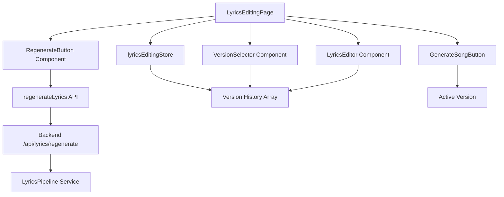

# Design Document

## Overview

This feature adds lyrics regeneration and version management capabilities to the LearningSong application. Users can generate multiple variations of lyrics from the same educational content and switch between them to find the best version for their song. The design integrates seamlessly with the existing LangGraph AI pipeline, Zustand state management, and React UI components.

## Architecture

### High-Level Flow

```
User clicks "Regenerate" 
  → Frontend validates and confirms
  → POST /api/lyrics/regenerate with original content
  → Backend invokes existing AI pipeline
  → New lyrics version created
  → Frontend stores in version history
  → UI updates to show new version
  → User can switch between versions
  → Selected version used for song generation
```

### Component Interaction



## Components and Interfaces

### Backend Components

#### 1. New API Endpoint

**File**: `backend/app/api/lyrics.py`

```python
@router.post("/regenerate", response_model=GenerateLyricsResponse)
async def regenerate_lyrics(
    request: RegenerateLyricsRequest,
    user_id: str = Depends(get_current_user)
) -> GenerateLyricsResponse
```

**Purpose**: Generate new lyrics from the same content without incrementing song generation quota.

#### 2. New Request Model

**File**: `backend/app/models/lyrics.py`

```python
class RegenerateLyricsRequest(BaseModel):
    content: str  # Original educational content
    search_enabled: bool = False
```

#### 3. Rate Limiter Extension

**File**: `backend/app/services/rate_limiter.py`

Add separate rate limiting for regenerations (10 per day for anonymous users).

### Frontend Components

#### 1. Version History Store Extension

**File**: `frontend/src/stores/lyricsEditingStore.ts`

```typescript
interface LyricsVersion {
  id: string  // UUID
  lyrics: string
  createdAt: Date
  isEdited: boolean
  editedLyrics?: string  // Stores manual edits
}

interface LyricsEditingState {
  // Existing fields...
  
  // New version management fields
  originalContent: string  // Store for regeneration
  versions: LyricsVersion[]
  activeVersionId: string | null
  isRegenerating: boolean
  regenerationError: string | null
  
  // New actions
  addVersion: (lyrics: string) => void
  setActiveVersion: (versionId: string) => void
  deleteVersion: (versionId: string) => void
  updateVersionEdits: (versionId: string, editedLyrics: string) => void
  startRegeneration: () => void
  completeRegeneration: (lyrics: string) => void
  failRegeneration: (error: string) => void
}
```

#### 2. Version Selector Component

**File**: `frontend/src/components/VersionSelector.tsx`

```typescript
interface VersionSelectorProps {
  versions: LyricsVersion[]
  activeVersionId: string | null
  onVersionSelect: (versionId: string) => void
  onVersionDelete: (versionId: string) => void
  disabled?: boolean
}
```

**UI Design**:
- Horizontal pill-style selector showing "Version 1", "Version 2", etc.
- Active version highlighted with primary color
- Timestamp tooltip on hover
- Delete icon (X) on each version (except if only one remains)
- Edited indicator (pencil icon) for manually modified versions
- Positioned above the lyrics textarea

#### 3. Regenerate Button Component

**File**: `frontend/src/components/RegenerateButton.tsx`

```typescript
interface RegenerateButtonProps {
  onRegenerate: () => void
  isRegenerating: boolean
  hasUnsavedEdits: boolean
  disabled?: boolean
}
```

**UI Design**:
- Secondary button with refresh icon
- Positioned next to "Generate Song" button
- Shows loading spinner when regenerating
- Confirmation dialog if user has unsaved edits

#### 4. API Integration

**File**: `frontend/src/api/lyrics.ts`

```typescript
export interface RegenerateLyricsRequest {
  content: string
  search_enabled: boolean
}

export const regenerateLyrics = async (
  request: RegenerateLyricsRequest
): Promise<GenerateLyricsResponse> => {
  return apiClient.post<GenerateLyricsResponse>(
    '/api/lyrics/regenerate', 
    request
  )
}
```

#### 5. Custom Hook

**File**: `frontend/src/hooks/useRegenerateLyrics.ts`

```typescript
export const useRegenerateLyrics = () => {
  const mutation = useMutation({
    mutationFn: regenerateLyrics,
    onSuccess: (data) => {
      // Add new version to store
    },
    onError: (error) => {
      // Handle error
    }
  })
  
  return {
    regenerate: mutation.mutate,
    isRegenerating: mutation.isPending,
    error: mutation.error
  }
}
```

## Data Models

### LyricsVersion

```typescript
interface LyricsVersion {
  id: string              // UUID v4
  lyrics: string          // Original generated lyrics
  createdAt: Date         // Timestamp of generation
  isEdited: boolean       // Whether user made manual changes
  editedLyrics?: string   // User's edited version (if any)
}
```

### Version History Storage

- Stored in `lyricsEditingStore` using Zustand persist middleware
- Uses `sessionStorage` for temporary persistence
- Cleared when user starts new content or session expires
- Maximum 10 versions per content (oldest auto-deleted)

### Backend Storage

No persistent storage for versions in MVP. All version management happens client-side in session storage. The backend only generates new lyrics on demand.

## Correctness Properties

*A property is a characteristic or behavior that should hold true across all valid executions of a system—essentially, a formal statement about what the system should do. Properties serve as the bridge between human-readable specifications and machine-verifiable correctness guarantees.*

### Property 1: Regeneration creates new version
*For any* regeneration request with valid content, the system should invoke the AI pipeline and add a new version to the version history with a unique ID and timestamp.
**Validates: Requirements 1.1**

### Property 2: UI disabled during regeneration
*For any* UI state where regeneration is in progress, the lyrics textarea should be disabled and a loading indicator should be visible.
**Validates: Requirements 1.2**

### Property 3: Successful regeneration updates active version
*For any* successful regeneration, the version history length should increase by one and the activeVersionId should point to the newly created version.
**Validates: Requirements 1.3**

### Property 4: Failed regeneration preserves state
*For any* failed regeneration attempt, the activeVersionId should remain unchanged and an error message should be set in state.
**Validates: Requirements 1.4**

### Property 5: Version switching preserves history
*For any* version selection operation, the versions array length and content should remain unchanged (invariant).
**Validates: Requirements 2.3**

### Property 6: Version selection updates display
*For any* version selection, the displayed lyrics in the textarea should match the selected version's lyrics (or editedLyrics if present).
**Validates: Requirements 2.2**

### Property 7: Active version indicator synchronization
*For any* version switch operation, the activeVersionId in state should equal the selected version's ID.
**Validates: Requirements 2.4**

### Property 8: Sequential version numbering
*For any* new version creation, the version number should be one greater than the maximum existing version number.
**Validates: Requirements 3.2**

### Property 9: Version display includes metadata
*For any* rendered version in the selector, the display should contain both the version number and a formatted timestamp.
**Validates: Requirements 3.1, 3.3**

### Property 10: Active version highlighting
*For any* rendered version selector, the active version should have the appropriate CSS class or aria-selected attribute set to true.
**Validates: Requirements 3.4**

### Property 11: Session persistence round-trip
*For any* version history, storing to sessionStorage and then loading should produce an equivalent version history with the same versions and activeVersionId.
**Validates: Requirements 4.1, 4.2**

### Property 12: Song generation uses active version
*For any* song generation request, the lyrics sent to the API should match the active version's editedLyrics (if present) or original lyrics.
**Validates: Requirements 4.3, 5.5**

### Property 13: Content change clears history
*For any* content hash change, the versions array should be reset to empty and activeVersionId should be null.
**Validates: Requirements 4.4**

### Property 14: Edit tracking
*For any* version where the displayed lyrics differ from the original version lyrics, the isEdited flag should be true.
**Validates: Requirements 5.1**

### Property 15: Edit indicator display
*For any* version with isEdited === true, an edit indicator should be rendered in the UI.
**Validates: Requirements 5.2**

### Property 16: Edit preservation during switch
*For any* version switch operation where the previous version had modified lyrics, those modifications should be saved to the version's editedLyrics field.
**Validates: Requirements 5.3**

### Property 17: Edited content restoration
*For any* version with editedLyrics populated, switching to that version should display the editedLyrics content.
**Validates: Requirements 5.4**

### Property 18: Version deletion removes from history
*For any* version deletion operation, the versions array length should decrease by one and the deleted version ID should not be present in the array.
**Validates: Requirements 6.1**

### Property 19: Non-active deletion preserves active
*For any* deletion of a version where versionId !== activeVersionId, the activeVersionId should remain unchanged.
**Validates: Requirements 6.2**

### Property 20: Active deletion switches to recent
*For any* deletion of the active version, the new activeVersionId should point to the most recent remaining version (highest createdAt timestamp).
**Validates: Requirements 6.3**

### Property 21: Rate limit check before regeneration
*For any* regeneration request, the rate limit check function should be invoked before the AI pipeline is called.
**Validates: Requirements 7.1**

### Property 22: Separate regeneration counter
*For any* regeneration operation, the regeneration counter should increment independently from the song generation counter.
**Validates: Requirements 7.3**

### Property 23: Chronological version ordering
*For any* rendered version selector, the versions should be displayed in chronological order based on createdAt timestamps.
**Validates: Requirements 8.1**

### Property 24: Keyboard navigation support
*For any* version selector with focus, pressing arrow keys should change the focused version in the expected direction.
**Validates: Requirements 8.3**

### Property 25: Screen reader announcements
*For any* version change operation, the UI should include aria-live regions that announce the current version information.
**Validates: Requirements 8.5**

## Error Handling

### Frontend Error Scenarios

1. **Regeneration API Failure**
   - Display toast notification with error message
   - Keep current version active
   - Enable retry button
   - Log error to console for debugging

2. **Rate Limit Exceeded**
   - Display specific error message: "Daily regeneration limit reached (10/10). Try again tomorrow."
   - Disable regenerate button
   - Show reset time in error message

3. **Network Timeout**
   - Show timeout error after 60 seconds
   - Offer retry option
   - Maintain current state

4. **Invalid Version Selection**
   - Fallback to most recent version
   - Log warning
   - Display toast notification

5. **Session Storage Quota Exceeded**
   - Remove oldest versions to make space
   - Display warning about version limit
   - Continue operation with reduced history

### Backend Error Scenarios

1. **AI Pipeline Failure**
   - Return 500 error with descriptive message
   - Log full error details
   - Don't increment rate limit counter

2. **Rate Limit Exceeded**
   - Return 429 error
   - Include reset time in response
   - Log rate limit hit

3. **Invalid Content**
   - Return 400 error with validation message
   - Don't increment rate limit counter

4. **OpenAI API Timeout**
   - Retry once with exponential backoff
   - If still fails, return 503 error
   - Log timeout event

## Testing Strategy

### Unit Testing

**Frontend Unit Tests** (Jest + React Testing Library):

1. **Store Tests** (`lyricsEditingStore.test.ts`):
   - Test version addition, deletion, switching
   - Test edit tracking and preservation
   - Test state reset on content change
   - Test activeVersionId management

2. **Component Tests**:
   - `VersionSelector.test.tsx`: Rendering, selection, deletion
   - `RegenerateButton.test.tsx`: Click handling, loading states, confirmation dialog
   - `LyricsEditingPage.test.tsx`: Integration of version management with existing features

3. **Hook Tests** (`useRegenerateLyrics.test.ts`):
   - Test mutation success/error handling
   - Test loading states
   - Test store integration

**Backend Unit Tests** (pytest):

1. **API Endpoint Tests** (`test_lyrics.py`):
   - Test regenerate endpoint with valid/invalid requests
   - Test rate limiting for regenerations
   - Test error responses

2. **Rate Limiter Tests** (`test_rate_limiter.py`):
   - Test separate counters for regeneration vs song generation
   - Test daily limit enforcement
   - Test counter reset logic

### Property-Based Testing

**Frontend Property Tests** (fast-check):

The property-based testing library for TypeScript/JavaScript is **fast-check**. Each property-based test should run a minimum of 100 iterations.

1. **Version Management Properties**:
   - Property 3: Generate random version histories, perform regeneration, verify length increases and active updates
   - Property 5: Generate random version arrays and selection operations, verify array unchanged
   - Property 8: Generate random version sequences, verify sequential numbering
   - Property 11: Generate random version histories, test sessionStorage round-trip
   - Property 13: Generate random content hashes, verify history cleared on change

2. **Edit Tracking Properties**:
   - Property 14: Generate random lyrics modifications, verify isEdited flag
   - Property 16: Generate random version switches with edits, verify preservation
   - Property 17: Generate random versions with editedLyrics, verify restoration

3. **Deletion Properties**:
   - Property 18: Generate random version arrays and deletion operations, verify removal
   - Property 19: Generate random non-active deletions, verify active preserved
   - Property 20: Generate random active deletions, verify switch to recent

**Backend Property Tests** (Hypothesis):

The property-based testing library for Python is **Hypothesis**. Each property-based test should run a minimum of 100 iterations.

1. **Rate Limiting Properties**:
   - Property 21: Generate random regeneration requests, verify rate limit check called first
   - Property 22: Generate random sequences of regenerations and song generations, verify separate counters

2. **Content Processing Properties**:
   - Property 1: Generate random valid content strings, verify pipeline invocation and version creation

### Integration Testing

1. **End-to-End Version Flow**:
   - Generate lyrics → Regenerate → Switch versions → Edit → Generate song
   - Verify correct version used for song generation

2. **Session Persistence**:
   - Generate multiple versions → Navigate away → Return → Verify versions restored

3. **Rate Limit Integration**:
   - Perform 10 regenerations → Verify 11th blocked → Verify song generation still works

### Accessibility Testing

1. **Keyboard Navigation**:
   - Tab through version selector
   - Use arrow keys to navigate versions
   - Press Enter to select version
   - Press Delete to remove version

2. **Screen Reader Testing**:
   - Verify version announcements
   - Verify edit indicators announced
   - Verify error messages announced

3. **Focus Management**:
   - Verify focus moves correctly after deletion
   - Verify focus visible on all interactive elements

## Performance Considerations

### Frontend Optimizations

1. **Version Limit**: Maximum 10 versions per content to prevent memory issues
2. **Lazy Rendering**: Only render visible version selector when versions.length > 1
3. **Debounced Edit Tracking**: Debounce isEdited flag updates by 500ms to avoid excessive re-renders
4. **Memoization**: Use React.memo for VersionSelector to prevent unnecessary re-renders

### Backend Optimizations

1. **Cache Reuse**: Check lyrics cache before regenerating (same content may be cached)
2. **Rate Limit Caching**: Cache rate limit checks in Redis for 60 seconds
3. **Pipeline Reuse**: Reuse LyricsPipeline instance across requests

### Storage Considerations

1. **SessionStorage Limits**: ~5MB limit, each version ~2-3KB, max 10 versions = ~30KB (well within limits)
2. **Cleanup Strategy**: Auto-delete oldest version when adding 11th version
3. **Compression**: Consider LZ-string compression if storage becomes an issue

## Security Considerations

1. **Rate Limiting**: Separate 10/day limit for regenerations prevents abuse
2. **Content Validation**: Reuse existing validation (max 10,000 words)
3. **User Isolation**: Regenerations tied to user_id, no cross-user access
4. **XSS Prevention**: Sanitize lyrics display (already handled by React)
5. **CSRF Protection**: Use existing Firebase token authentication

## Migration and Rollout

### Phase 1: Backend Implementation
- Add regenerate endpoint
- Add separate rate limiting
- Deploy and test in staging

### Phase 2: Frontend Core
- Extend store with version management
- Add RegenerateButton component
- Add basic version switching
- Deploy behind feature flag

### Phase 3: Frontend Polish
- Add VersionSelector UI
- Add edit tracking
- Add keyboard navigation
- Add accessibility features
- Enable feature flag for all users

### Phase 4: Monitoring and Optimization
- Monitor regeneration usage
- Track version switching patterns
- Optimize based on user behavior
- Gather feedback

## Future Enhancements

1. **Version Naming**: Allow users to name/label versions
2. **Version Comparison**: Side-by-side comparison of two versions
3. **Persistent History**: Store versions in Firestore for cross-session access
4. **Undo/Redo**: Add undo/redo for edits within a version
5. **Export Versions**: Download all versions as a text file
6. **AI Variation Control**: Let users specify "more creative" or "more factual" for regeneration
