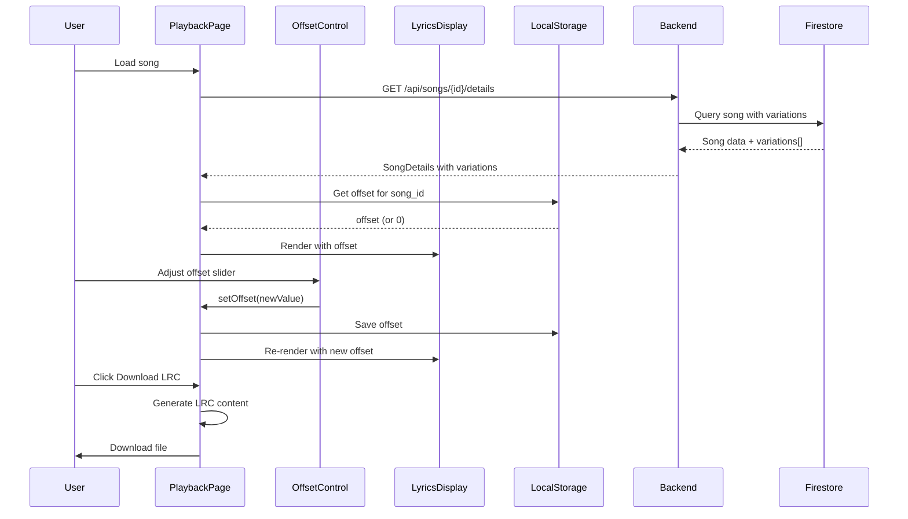

# Design Document

## Overview

This feature enhances the Song Playback page with four key improvements:

1. **Dual Song Selection UI Fix**: Ensure both song variations from Suno API are properly extracted, stored, and displayed in the SongSwitcher component.

2. **Timestamp Lyrics Offset Adjustment**: Add a user-adjustable offset control to compensate for timing discrepancies between Suno API timestamps and actual audio playback.

3. **Song History Access**: Provide a song history page allowing users to access and replay previously created songs within the 48-hour retention period.

4. **LRC Subtitle File Export**: Enable users to download synchronized lyrics as LRC files for use with external music players.

### Key Design Goals

1. **Fix Existing Functionality**: Ensure the SongSwitcher displays when two variations exist
2. **User Control**: Allow fine-tuning of lyrics synchronization via offset adjustment
3. **Data Persistence**: Remember user preferences and provide access to song history
4. **Interoperability**: Export lyrics in standard LRC format for external players

## Architecture

### High-Level Flow

```
┌─────────────────────────────────────────────────────────────────┐
│                    Song Playback Page                            │
├─────────────────────────────────────────────────────────────────┤
│  ┌─────────────────┐  ┌─────────────────┐  ┌─────────────────┐ │
│  │  Audio Player   │  │  Song Switcher  │  │  History Link   │ │
│  │  (with offset)  │  │  (V1 / V2)      │  │  (→ /history)   │ │
│  └─────────────────┘  └─────────────────┘  └─────────────────┘ │
│                                                                  │
│  ┌─────────────────────────────────────────────────────────────┐│
│  │                    Lyrics Display                            ││
│  │  - Word-level highlighting with offset applied               ││
│  │  - Auto-scroll to current word                               ││
│  └─────────────────────────────────────────────────────────────┘│
│                                                                  │
│  ┌─────────────────────────────────────────────────────────────┐│
│  │  Offset Control: [-] ═══════●═══════ [+]  -150ms  [Reset]   ││
│  └─────────────────────────────────────────────────────────────┘│
│                                                                  │
│  ┌─────────────────┐                                            │
│  │  Download LRC   │                                            │
│  └─────────────────┘                                            │
└─────────────────────────────────────────────────────────────────┘
```

### Component Interaction Diagram



## Components and Interfaces

### Frontend Components

#### 1. OffsetControl Component (`frontend/src/components/OffsetControl.tsx`)

**New Component:**

```typescript
interface OffsetControlProps {
  offset: number              // Current offset in milliseconds
  onChange: (offset: number) => void
  min?: number               // Default: -2000
  max?: number               // Default: 2000
  step?: number              // Default: 50
  disabled?: boolean
}

export function OffsetControl({
  offset,
  onChange,
  min = -2000,
  max = 2000,
  step = 50,
  disabled = false
}: OffsetControlProps) {
  // Renders slider with +/- buttons and reset
  // Shows current value in milliseconds
  // Keyboard accessible
  // ARIA labels for screen readers
}
```

#### 2. LrcDownloadButton Component (`frontend/src/components/LrcDownloadButton.tsx`)

**New Component:**

```typescript
interface LrcDownloadButtonProps {
  alignedWords: AlignedWord[]
  songStyle: string
  createdAt: Date
  offset?: number            // Apply offset to timestamps
  disabled?: boolean
}

export function LrcDownloadButton({
  alignedWords,
  songStyle,
  createdAt,
  offset = 0,
  disabled = false
}: LrcDownloadButtonProps) {
  // Generates LRC file content
  // Triggers download with proper filename
  // Hidden when alignedWords is empty
}
```

#### 3. SongHistoryPage (`frontend/src/pages/SongHistoryPage.tsx`)

**New Page:**

```typescript
export function SongHistoryPage() {
  // Fetches user's song history from API
  // Displays list with style, date, expiration countdown
  // Navigates to playback page on click
  // Shows empty state when no songs
}
```

#### 4. SongHistoryItem Component (`frontend/src/components/SongHistoryItem.tsx`)

**New Component:**

```typescript
interface SongHistoryItemProps {
  song: SongHistorySummary
  onClick: (songId: string) => void
}

export function SongHistoryItem({ song, onClick }: SongHistoryItemProps) {
  // Displays song style icon, creation date
  // Shows expiration countdown
  // Lyrics preview (first 50 chars)
  // Keyboard accessible
}
```

### Updated Components

#### 5. Updated LyricsDisplay (`frontend/src/components/LyricsDisplay.tsx`)

**Changes:**
- Add `offset` prop to apply timing adjustment
- Modify `useLyricsSync` hook call to include offset

```typescript
interface LyricsDisplayProps {
  lyrics: string
  currentTime: number
  duration: number
  alignedWords?: AlignedWord[]
  offset?: number              // NEW: Offset in milliseconds
  onManualScroll?: () => void
}
```

#### 6. Updated SongPlaybackPage (`frontend/src/pages/SongPlaybackPage.tsx`)

**Changes:**
- Add offset state management
- Load/save offset from localStorage
- Integrate OffsetControl component
- Integrate LrcDownloadButton component
- Add link to song history

### Backend Components

#### 1. Song History API Endpoint (`backend/app/api/songs.py`)

**New Endpoint:**

```python
@router.get("/history", response_model=list[SongHistorySummary])
async def get_song_history(
    user_id: str = Depends(get_current_user),
    limit: int = Query(default=20, le=20)
) -> list[SongHistorySummary]:
    """
    Get user's song history (non-expired songs).
    
    Returns:
        List of SongHistorySummary ordered by created_at DESC
    """
```

#### 2. Song History Summary Model (`backend/app/models/songs.py`)

**New Model:**

```python
class SongHistorySummary(BaseModel):
    """Summary of a song for history list."""
    
    song_id: str
    style: MusicStyle
    created_at: datetime
    expires_at: datetime
    lyrics_preview: str = Field(
        ...,
        description="First 100 characters of lyrics",
        max_length=100
    )
    has_variations: bool
    primary_variation_index: int
```


## Data Models

### Frontend Models

#### OffsetStorage

```typescript
interface OffsetStorage {
  [songId: string]: {
    offset: number      // Offset in milliseconds
    updatedAt: number   // Timestamp for LRU eviction
  }
}

// LocalStorage key: 'lyrics-offset-storage'
// Max entries: 50 (LRU eviction)
```

#### SongHistorySummary (TypeScript)

```typescript
interface SongHistorySummary {
  song_id: string
  style: MusicStyle
  created_at: string      // ISO datetime
  expires_at: string      // ISO datetime
  lyrics_preview: string  // First 100 chars
  has_variations: boolean
  primary_variation_index: number
}
```

### LRC File Format

```
[ti:LearningSong - Pop]
[ar:AI Generated]
[al:LearningSong]
[by:LearningSong App]
[offset:0]

[00:20.40]In 
[00:20.30]the 
[00:20.40]world 
[00:20.78]of 
[00:21.06]science, 
```

**Format Rules:**
- Timestamps: `[mm:ss.xx]` where xx is centiseconds
- One word per line for word-level sync
- Metadata tags at the top
- Offset tag reflects user's adjustment

## Correctness Properties

*A property is a characteristic or behavior that should hold true across all valid executions of a system-essentially, a formal statement about what the system should do. Properties serve as the bridge between human-readable specifications and machine-verifiable correctness guarantees.*

### Property 1: Variation extraction completeness
*For any* valid Suno API response containing a sunoData array with N variations (0 ≤ N ≤ 2), the system should extract exactly N variations with their audio_url, audio_id, and variation_index fields.
**Validates: Requirements 1.1, 1.2**

### Property 2: Variation storage round-trip
*For any* set of song variations stored in Firestore, retrieving the song should return the same variations with identical audio_url, audio_id, and variation_index values.
**Validates: Requirements 1.2, 1.3**

### Property 3: SongSwitcher visibility condition
*For any* song with variations.length >= 2, the SongSwitcher component should be rendered; for variations.length < 2, it should not be rendered.
**Validates: Requirements 1.4**

### Property 4: Offset application to timestamps
*For any* aligned word with startS and endS, and any offset value O (in milliseconds), the effective timestamps used for highlighting should be (startS + O/1000) and (endS + O/1000).
**Validates: Requirements 2.1**

### Property 5: Offset range constraint
*For any* offset adjustment attempt, the resulting offset should be clamped to the range [-2000, 2000] milliseconds.
**Validates: Requirements 2.6**

### Property 6: Offset increment/decrement
*For any* click on the minus button, the offset should decrease by exactly 50ms (unless at minimum); for plus button, increase by exactly 50ms (unless at maximum).
**Validates: Requirements 3.3, 3.4**

### Property 7: Offset persistence round-trip
*For any* offset value saved to localStorage for a song_id, loading that song should restore the same offset value.
**Validates: Requirements 2.3, 2.4, 9.1, 9.2**

### Property 8: Offset storage LRU eviction
*For any* offset storage with more than 50 entries, the oldest entries (by updatedAt) should be removed to maintain the 50-entry limit.
**Validates: Requirements 9.3**

### Property 9: Song history ordering
*For any* list of songs returned by the history API, they should be ordered by created_at in descending order (newest first).
**Validates: Requirements 4.3**

### Property 10: Song history expiration filtering
*For any* song in the history response, its expires_at should be in the future (not expired).
**Validates: Requirements 4.4, 6.1**

### Property 11: Song history response completeness
*For any* song in the history response, it should contain song_id, style, created_at, expires_at, and lyrics_preview fields.
**Validates: Requirements 6.2**

### Property 12: Song history limit
*For any* history API response, the number of songs should not exceed 20.
**Validates: Requirements 6.3**

### Property 13: LRC timestamp format
*For any* timestamp in the generated LRC file, it should match the pattern `[mm:ss.xx]` where mm is minutes (00-99), ss is seconds (00-59), and xx is centiseconds (00-99).
**Validates: Requirements 7.3**

### Property 14: LRC content completeness
*For any* generated LRC file, it should contain metadata tags (ti, ar, al, by, offset) followed by timestamped lyrics lines.
**Validates: Requirements 7.4**

### Property 15: LRC download visibility
*For any* song with alignedWords.length > 0, the download button should be visible; for alignedWords.length === 0, it should be hidden.
**Validates: Requirements 7.1, 7.6**

### Property 16: Offset control accessibility
*For any* rendered OffsetControl component, it should have aria-label, aria-valuemin, aria-valuemax, and aria-valuenow attributes.
**Validates: Requirements 8.1**

### Property 17: Screen reader offset announcement
*For any* offset value change, the new value should be announced via an aria-live region.
**Validates: Requirements 8.5**

### Property 18: Section marker detection
*For any* aligned word with text matching the pattern `**...**` (text surrounded by double asterisks), the system should classify it as a section marker.
**Validates: Requirements 10.1, 10.2**

### Property 19: Section marker highlighting skip
*For any* playback time that falls within a section marker's timestamp range, the current word highlight should be applied to the next non-marker word instead of the marker.
**Validates: Requirements 10.4, 10.5**

### Property 20: Section marker visibility toggle
*For any* toggle of marker visibility, the display should immediately update to show or hide all section markers while preserving the highlighting of actual lyrics.
**Validates: Requirements 11.2, 11.3**

### Property 21: Section marker visibility persistence
*For any* marker visibility preference saved to localStorage, loading the lyrics display should restore the same visibility state.
**Validates: Requirements 11.4, 11.5**

## Error Handling

### Frontend Error Scenarios

#### 1. LocalStorage Unavailable
**Scenario:** Browser localStorage is disabled or full

**Handling:**
- Catch storage errors gracefully
- Continue with offset = 0
- Log warning to console
- Do not show error to user

#### 2. Invalid Offset in Storage
**Scenario:** Stored offset value is corrupted or invalid

**Handling:**
- Validate offset is a number within range
- Default to 0 if invalid
- Remove corrupted entry from storage

#### 3. Song History API Error
**Scenario:** Backend returns error when fetching history

**Handling:**
- Display error message with retry button
- Show empty state if network error
- Log error for debugging

#### 4. LRC Generation Error
**Scenario:** Error generating LRC file content

**Handling:**
- Show toast error message
- Log error with aligned words data
- Disable download button temporarily

### Backend Error Scenarios

#### 1. Firestore Query Error
**Scenario:** Error querying song history from Firestore

**Handling:**
- Return 500 error with generic message
- Log detailed error for debugging
- Include request ID for tracing

#### 2. No Variations in Suno Response
**Scenario:** Suno API returns empty sunoData array

**Handling:**
- Log warning with task_id
- Store empty variations array
- Mark task as failed if no audio available

## Testing Strategy

### Unit Testing

#### Frontend Unit Tests

**File: `frontend/tests/OffsetControl.test.tsx`**
- Test rendering with default props
- Test slider value changes
- Test +/- button clicks
- Test range constraints
- Test reset button
- Test keyboard accessibility
- Test ARIA attributes

**File: `frontend/tests/LrcDownloadButton.test.tsx`**
- Test rendering when alignedWords exist
- Test hidden when alignedWords empty
- Test LRC content generation
- Test filename format
- Test offset application to timestamps

**File: `frontend/tests/SongHistoryPage.test.tsx`**
- Test loading state
- Test empty state
- Test list rendering
- Test navigation on click
- Test error state

**File: `frontend/tests/offset-storage.test.ts`**
- Test save/load offset
- Test LRU eviction
- Test invalid data handling
- Test storage full handling

#### Backend Unit Tests

**File: `backend/tests/test_song_history_api.py`**
- Test GET /api/songs/history returns user's songs
- Test ordering by created_at DESC
- Test limit parameter
- Test expired songs filtered
- Test empty response for new user
- Test 401 for unauthenticated request

### Property-Based Testing

**Framework:** fast-check (TypeScript) for frontend, Hypothesis (Python) for backend

**Configuration:** Minimum 100 iterations per property test

#### Frontend Property Tests

**File: `frontend/tests/offset.props.test.ts`**

```typescript
// Property 4: Offset application to timestamps
test.prop([fc.float(), fc.float(), fc.integer(-2000, 2000)])(
  'offset is correctly applied to timestamps',
  (startS, endS, offsetMs) => {
    const effectiveStart = startS + offsetMs / 1000
    const effectiveEnd = endS + offsetMs / 1000
    // Verify highlighting uses effective timestamps
  }
)

// Property 5: Offset range constraint
test.prop([fc.integer()])(
  'offset is clamped to valid range',
  (rawOffset) => {
    const clamped = clampOffset(rawOffset)
    expect(clamped).toBeGreaterThanOrEqual(-2000)
    expect(clamped).toBeLessThanOrEqual(2000)
  }
)
```

**File: `frontend/tests/lrc-generator.props.test.ts`**

```typescript
// Property 13: LRC timestamp format
test.prop([fc.float({ min: 0, max: 3600 })])(
  'timestamps are formatted correctly',
  (seconds) => {
    const formatted = formatLrcTimestamp(seconds)
    expect(formatted).toMatch(/^\[\d{2}:\d{2}\.\d{2}\]$/)
  }
)
```

#### Backend Property Tests

**File: `backend/tests/test_song_history_props.py`**

```python
# Property 9: Song history ordering
@given(lists(song_summaries(), min_size=1, max_size=20))
def test_history_is_ordered_by_created_at_desc(songs):
    """
    Feature: song-playback-improvements, Property 9: Song history ordering
    For any list of songs, they should be ordered newest first.
    """
    sorted_songs = sort_by_created_at_desc(songs)
    for i in range(len(sorted_songs) - 1):
        assert sorted_songs[i].created_at >= sorted_songs[i + 1].created_at

# Property 10: Song history expiration filtering
@given(lists(song_summaries_with_expiration()))
def test_expired_songs_are_filtered(songs):
    """
    Feature: song-playback-improvements, Property 10: Song history expiration filtering
    For any song in response, expires_at should be in the future.
    """
    filtered = filter_expired(songs)
    now = datetime.now(timezone.utc)
    for song in filtered:
        assert song.expires_at > now
```

### Integration Tests

**File: `frontend/tests/SongPlaybackPage.integration.test.tsx`**
- Test offset control integration with lyrics display
- Test offset persistence across page reloads
- Test LRC download with offset applied
- Test song switcher with variations

**File: `backend/tests/test_song_history_integration.py`**
- Test full flow: create song → fetch history → verify in list
- Test expiration: create song → wait → verify removed from history

