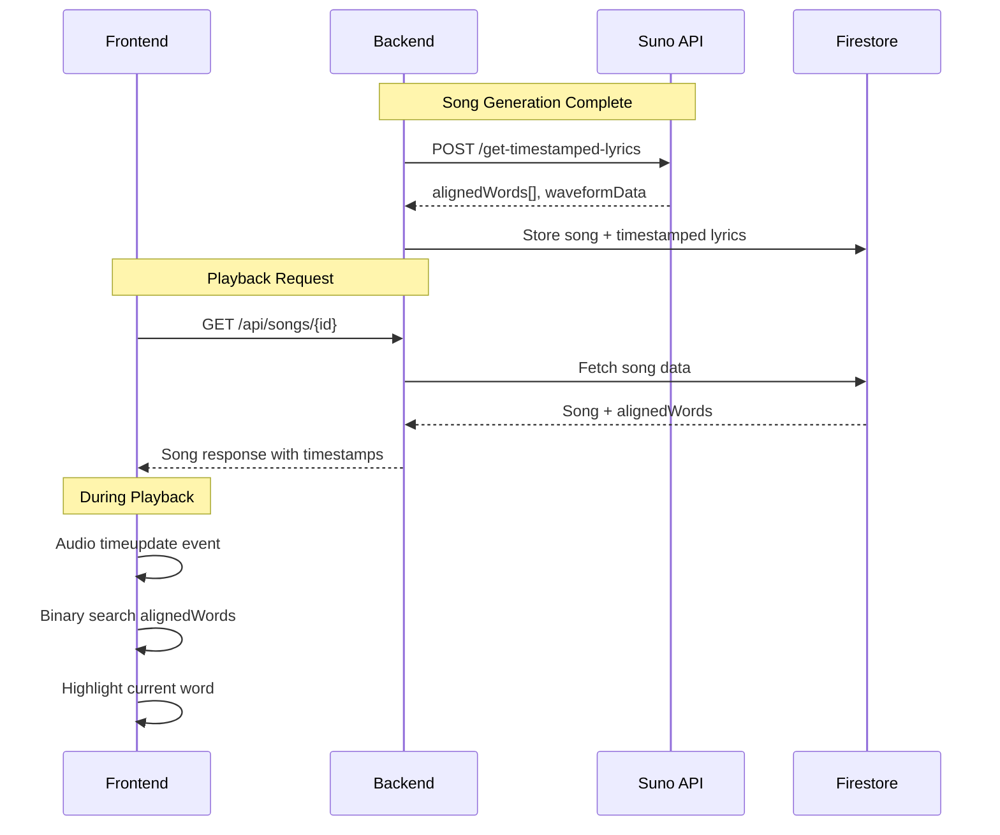

# Design Document

## Overview

This design implements precise lyrics synchronization by integrating the Suno API's `get-timestamped-lyrics` endpoint. The solution involves:

1. **Backend**: Extending the SunoClient to fetch timestamped lyrics after song generation completes
2. **Storage**: Storing aligned words data alongside song metadata in Firestore
3. **API**: Exposing timestamped lyrics through the existing song retrieval endpoints
4. **Frontend**: Updating LyricsDisplay to use actual timestamps with binary search for efficient lookup

## Architecture



## Components and Interfaces

### Backend Components

#### 1. SunoClient Extension

```python
@dataclass
class AlignedWord:
    """Represents a word with timing information."""
    word: str
    start_s: float  # Start time in seconds
    end_s: float    # End time in seconds
    success: bool
    palign: float

@dataclass
class TimestampedLyrics:
    """Response from timestamped lyrics endpoint."""
    aligned_words: list[AlignedWord]
    waveform_data: list[float]
    hoot_cer: float
    is_streamed: bool

class SunoClient:
    async def get_timestamped_lyrics(
        self, 
        task_id: str, 
        audio_id: str
    ) -> TimestampedLyrics:
        """Fetch timestamped lyrics for a generated song."""
```

#### 2. Song Model Extension

```python
class SongMetadata(BaseModel):
    # Existing fields...
    song_url: str
    lyrics: str
    style: MusicStyle
    
    # New fields for timestamped lyrics
    aligned_words: list[dict] | None = None
    waveform_data: list[float] | None = None
    has_timestamps: bool = False
```

#### 3. Songs API Extension

```python
@router.get("/api/songs/{song_id}")
async def get_song(song_id: str) -> SongResponse:
    """Returns song data including timestamped lyrics if available."""
```

### Frontend Components

#### 1. Types

```typescript
interface AlignedWord {
  word: string
  startS: number  // Start time in seconds
  endS: number    // End time in seconds
  success: boolean
  palign: number
}

interface TimestampedLyrics {
  alignedWords: AlignedWord[]
  waveformData: number[]
  hasTimestamps: boolean
}
```

#### 2. useLyricsSync Hook

```typescript
interface UseLyricsSyncOptions {
  alignedWords: AlignedWord[]
  currentTime: number
}

interface UseLyricsSyncResult {
  currentWordIndex: number
  currentWord: AlignedWord | null
  progress: number  // 0-1 progress through current word
}

function useLyricsSync(options: UseLyricsSyncOptions): UseLyricsSyncResult
```

#### 3. Updated LyricsDisplay Component

```typescript
interface LyricsDisplayProps {
  lyrics: string
  currentTime: number
  duration: number
  alignedWords?: AlignedWord[]  // New prop for timestamps
  onManualScroll?: () => void
}
```

## Data Models

### Firestore Song Document

```json
{
  "song_id": "abc123",
  "user_id": "user456",
  "task_id": "task789",
  "audio_id": "audio012",
  "song_url": "https://...",
  "lyrics": "Full lyrics text...",
  "style": "pop",
  "created_at": "2025-12-01T00:00:00Z",
  "expires_at": "2025-12-03T00:00:00Z",
  "aligned_words": [
    {
      "word": "[Verse]\nFirst line",
      "startS": 1.36,
      "endS": 2.45,
      "success": true,
      "palign": 0
    }
  ],
  "waveform_data": [0, 0.5, 1, 0.75],
  "has_timestamps": true
}
```

### Frontend Song Store Extension

```typescript
interface SongPlaybackState {
  // Existing fields...
  songUrl: string | null
  lyrics: string
  
  // New fields
  alignedWords: AlignedWord[]
  hasTimestamps: boolean
  waveformData: number[]
}
```


## Correctness Properties

*A property is a characteristic or behavior that should hold true across all valid executions of a system-essentially, a formal statement about what the system should do. Properties serve as the bridge between human-readable specifications and machine-verifiable correctness guarantees.*

### Property 1: Timestamped lyrics fetch on song completion

*For any* successfully completed song generation task, the system should call the Suno timestamped lyrics endpoint with the correct task_id and audio_id parameters.

**Validates: Requirements 1.1, 2.1**

### Property 2: Correct word highlighting by time

*For any* aligned words array and any playback time within the song duration, the highlighted word should be the one whose time range (startS to endS) contains the current playback time.

**Validates: Requirements 1.2**

### Property 3: Timestamped lyrics storage integrity

*For any* timestamped lyrics response from the Suno API, storing and retrieving the data should preserve all aligned words with their word, startS, and endS fields intact.

**Validates: Requirements 2.2, 2.3**

### Property 4: Binary search correctness

*For any* sorted array of aligned words (sorted by startS) and any time value, binary search should return the word whose time range contains that value, or the nearest word if no exact match exists, in O(log n) comparisons.

**Validates: Requirements 4.1, 4.2**

### Property 5: Word state classification

*For any* aligned word and current playback time, the word should be classified as exactly one of: "current" (startS <= time <= endS), "completed" (endS < time), or "upcoming" (startS > time).

**Validates: Requirements 5.1, 5.2**

## Error Handling

### Backend Error Handling

| Error Scenario | Handling Strategy |
|----------------|-------------------|
| Timestamped lyrics API timeout | Log warning, return song without timestamps, set `has_timestamps: false` |
| Timestamped lyrics API 404 | Log info (may not be available yet), retry once after 5s delay |
| Timestamped lyrics API 500 | Log error, return song without timestamps |
| Invalid response format | Log error with response body, return song without timestamps |
| Missing audio_id | Skip timestamp fetch, log warning |

### Frontend Error Handling

| Error Scenario | Handling Strategy |
|----------------|-------------------|
| No aligned words in response | Fall back to linear interpolation method |
| Malformed aligned word entry | Skip entry, continue with valid entries |
| Binary search returns no match | Highlight nearest word or none if empty |
| Time outside song duration | Clamp to valid range (0 to duration) |

## Testing Strategy

### Unit Testing

**Backend Tests:**
- Test `SunoClient.get_timestamped_lyrics()` with mocked HTTP responses
- Test error handling for various API failure scenarios
- Test data model serialization/deserialization

**Frontend Tests:**
- Test `useLyricsSync` hook with various aligned words arrays
- Test binary search function with edge cases (empty array, single element, time at boundaries)
- Test word state classification logic
- Test fallback behavior when timestamps unavailable

### Property-Based Testing

**Library:** Hypothesis (Python backend), fast-check (TypeScript frontend)

**Backend Properties:**
1. Round-trip property: Storing and retrieving timestamped lyrics preserves all data
2. API call property: Successful generation always triggers timestamp fetch

**Frontend Properties:**
1. Binary search property: For any sorted array and time, search finds correct word
2. Word classification property: Every word is classified into exactly one state
3. Highlight property: Current time always falls within highlighted word's range (when timestamps available)

### Integration Testing

- End-to-end test: Generate song → fetch timestamps → playback with sync
- Test WebSocket flow includes timestamp data
- Test shared song links include timestamp data

